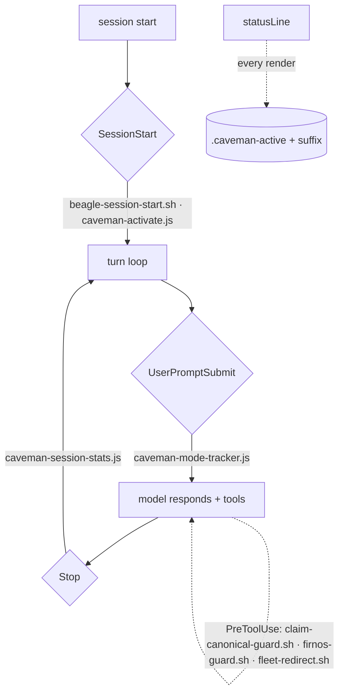

# 02 · Local map — how THIS system is wired (GENERATED)

> GENERATED by `firn architecture` — **do not hand-edit**. Walked from
> disk; re-run after any config change. Idempotent (no timestamp): a diff
> here means the system actually moved. This is layer 2 of the bundle —
> see [README.md](README.md) (start here), [01-canonical.md](01-canonical.md)
> (how Claude Code works), [03-lodestar.md](03-lodestar.md) (the substrate).

Repo: `~/code/nixos-config` · Claude config: `~/.claude`

## Layer 1 — LOCAL: CLAUDE.md precedence chain

Claude merges these by proximity (global → local; nearest wins). Only the
first few load in any given session — the rest are per-repo context.

| scope | loads | materialization | source-of-truth | lines |
|---|---|---|---|---|
| `global` | every session, lowest precedence | nix store → dotfiles (out-of-store) | `~/code/nixos-config/dotfiles/claude/CLAUDE.md` | 61 |
| `code-root` | any repo under ~/code | nix store → dotfiles (out-of-store) | `~/code/nixos-config/dotfiles/code/CLAUDE.md` | 3 |
| `repo` | this repo (nixos-config) | real file (is its own source) | `~/code/nixos-config/CLAUDE.md` | 422 |
| `module:claude` | editing ~/code/nixos-config/modules/claude/ | real file (is its own source) | `~/code/nixos-config/modules/claude/CLAUDE.md` | 77 |
| `module:containers` | editing ~/code/nixos-config/modules/containers/ | real file (is its own source) | `~/code/nixos-config/modules/containers/CLAUDE.md` | 7 |

## Layer 1 — LOCAL: `~/.claude` wired surface

What the `~/code/nixos-config/modules/claude` module materializes into `~/.claude`. `runtime-writable` = claude-code can atomic-write it (the rest are repo-edit-then-it's-live).

| path | kind | materialization | runtime-writable | source-of-truth |
|---|---|---|---|---|
| `~/.claude/CLAUDE.md` | symlink | nix store → dotfiles (out-of-store) | — | `~/code/nixos-config/dotfiles/claude/CLAUDE.md` |
| `~/.claude/settings.json` | symlink | direct → dotfiles | ✅ | `~/code/nixos-config/dotfiles/claude/settings.json` |
| `~/.claude/commands` | symlink | nix store → dotfiles (out-of-store) | — | `~/code/nixos-config/dotfiles/claude/commands` |
| `~/.claude/skills` | symlink | nix store → dotfiles (out-of-store) | — | `~/code/nixos-config/dotfiles/claude/skills` |
| `~/.claude/hooks` | symlink | nix store → dotfiles (out-of-store) | — | `~/code/nixos-config/dotfiles/claude/hooks` |

## Layer 1 — LOCAL: runtime wiring (`settings.json` + plugin manifests)

- **statusLine** → `f=$(ls -dt "$HOME"/.claude/plugins/cache/caveman/caveman/*/src/hooks/caveman-statusline.sh…`
- **enabledPlugins** → `rust-analyzer-lsp@claude-plugins-official`, `typescript-lsp@claude-plugins-official`, `caveman@caveman`
- **hooks** (Claude Code fires these at lifecycle points; `⟨src⟩` = settings.json or the plugin that contributes it):
  - `SessionStart` → `beagle-session-start.sh` ⟨settings⟩, `caveman-activate.js` ⟨caveman⟩
  - `UserPromptSubmit` → `caveman-mode-tracker.js` ⟨caveman⟩
  - `PreToolUse` → `claim-canonical-guard.sh` ⟨settings⟩, `firnos-guard.sh` ⟨settings⟩, `fleet-redirect.sh` ⟨settings⟩, `firnos-guard.sh` ⟨settings⟩
  - `Stop` → `caveman-session-stats.js` ⟨caveman⟩

### Control flow (lifecycle spine)

## Layer 2 — SUBSTRATE: what the config points at

**Plugins** (installed under `~/.claude/plugins/cache`):

| plugin | version/sha | install path |
|---|---|---|
| `rust-analyzer-lsp@claude-plugins-official` | `1.0.0` | `~/.claude/plugins/cache/claude-plugins-official/rust-analyzer-lsp/1.0.0` |
| `typescript-lsp@claude-plugins-official` | `1.0.0` | `~/.claude/plugins/cache/claude-plugins-official/typescript-lsp/1.0.0` |
| `lean@leanprover` | `0.1.0` | `~/.claude/plugins/cache/leanprover/lean/0.1.0` |
| `caveman@caveman` | `37c28ebb1e0a` | `~/.claude/plugins/cache/caveman/caveman/37c28ebb1e0a` |

**MCP servers** (user scope — where lodestar plugs into Claude):

| server | command |
|---|---|
| `lodestar` | `~/code/lodestar/bin/lodestar-mcp` |
| `fram` | `~/code/fram/bin/fram-mcp` |

> Layer 3 (CANONICAL Anthropic contracts) is annotated inline above where
> it governs a local choice. A fuller canonical corpus is the next phase —
> see `~/code/nixos-config/modules/claude/CLAUDE.md` and the `claude-code-guide` skill.

