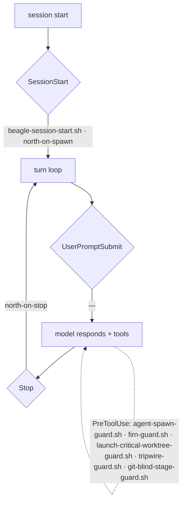

# 02 · Local map — how THIS system is wired (GENERATED)

> GENERATED by `firn architecture` — **do not hand-edit**. Walked from
> disk; re-run after any config change. Idempotent (no timestamp): a diff
> here means the system actually moved. This is layer 2 of the bundle —
> see [README.md](README.md) (start here), [01-canonical.md](01-canonical.md)
> (how Claude Code works), [03-north.md](03-north.md) (the substrate).

Repo: `~/code/nixos-config/main` · Claude config: `~/.claude`

## Layer 1 — LOCAL: CLAUDE.md precedence chain

Claude merges these by proximity (global → local; nearest wins). Only the
first few load in any given session — the rest are per-repo context.

| scope | loads | materialization | source-of-truth | lines |
|---|---|---|---|---|
| `global` | every session, lowest precedence | direct → North profile | `~/code/north/main/profiles/tom/AGENTS.md` | 338 |
| `code-root` | any repo under ~/code | unmanaged symlink | `~/code/nixos-config/main/dotfiles/code/AGENTS.md` | 106 |
| `repo` | this repo (nixos-config) | unmanaged symlink | `~/code/nixos-config/main/AGENTS.md` | 135 |
| `module:claude` | editing ~/code/nixos-config/main/modules/claude/ | real file (is its own source) | `~/code/nixos-config/main/modules/claude/CLAUDE.md` | 16 |
| `module:containers` | editing ~/code/nixos-config/main/modules/containers/ | real file (is its own source) | `~/code/nixos-config/main/modules/containers/CLAUDE.md` | 7 |

## Layer 1 — LOCAL: `~/.claude` wired surface

What the `~/code/nixos-config/main/modules/claude` module materializes into `~/.claude`. `runtime-writable` = claude-code can atomic-write it (the rest are repo-edit-then-it's-live).

| path | kind | materialization | runtime-writable | source-of-truth |
|---|---|---|---|---|
| `~/.claude/CLAUDE.md` | symlink | direct → North profile | — | `~/code/north/main/profiles/tom/AGENTS.md` |
| `~/.claude/settings.json` | file | real file (is its own source) | ✅ | `~/.claude/settings.json` |
| `~/.claude/commands` | symlink | direct → dotfiles | ✅ | `~/code/nixos-config/main/dotfiles/claude/commands` |
| `~/.claude/skills` | symlink | direct → North profile | — | `~/code/north/main/profiles/tom/skills` |
| `~/.claude/hooks` | symlink | direct → North profile | — | `~/code/north/main/profiles/tom/hooks` |

## Layer 1 — LOCAL: runtime wiring (`settings.json` + plugin manifests)

- **statusLine** → `bash "$HOME/code/nixos-config/dotfiles/claude/statusline.sh"`
- **enabledPlugins** → `rust-analyzer-lsp@claude-plugins-official`, `typescript-lsp@claude-plugins-official`, `orchestration@orchestration`
- **hooks** (Claude Code fires these at lifecycle points; `⟨src⟩` = settings.json or the plugin that contributes it):
  - `SessionStart` → `beagle-session-start.sh` ⟨settings⟩, `north-on-spawn` ⟨settings⟩
  - `PreToolUse` → `agent-spawn-guard.sh` ⟨settings⟩, `firn-guard.sh` ⟨settings⟩, `launch-critical-worktree-guard.sh` ⟨settings⟩, `agent-spawn-guard.sh` ⟨settings⟩, `tripwire-guard.sh` ⟨settings⟩, `firn-guard.sh` ⟨settings⟩, `git-blind-stage-guard.sh` ⟨settings⟩, `launch-critical-worktree-guard.sh` ⟨settings⟩
  - `PostToolUse` → `logcompress-hook.js` ⟨settings⟩, `racket-build-guard.sh` ⟨settings⟩, `north-on-tooluse` ⟨settings⟩, `north-mark-delegated` ⟨settings⟩
  - `Stop` → `north-on-stop` ⟨settings⟩

### Control flow (lifecycle spine)

## Layer 2 — SUBSTRATE: what the config points at

**Plugins** (installed under `~/.claude/plugins/cache`):

| plugin | version/sha | install path |
|---|---|---|
| `rust-analyzer-lsp@claude-plugins-official` | `1.0.0` | `~/.claude/plugins/cache/claude-plugins-official/rust-analyzer-lsp/1.0.0` |
| `typescript-lsp@claude-plugins-official` | `1.0.0` | `~/.claude/plugins/cache/claude-plugins-official/typescript-lsp/1.0.0` |
| `lean@leanprover` | `0.1.0` | `~/.claude/plugins/cache/leanprover/lean/0.1.0` |
| `orchestration@orchestration` | `9c6acd66ff1d` | `~/.claude/plugins/cache/orchestration/orchestration/9c6acd66ff1d` |

**MCP servers** (user scope — where north plugs into Claude):

| server | command |
|---|---|
| `linear-mcp-msa-new` | `.` |
| `fram` | `/nix/store/5nrs7044a8n6ygdylya0kgbam8awg2w4-fram-0-unstable-2026-07-29-72c1dcc/bin/fram-mcp` |
| `north` | `/nix/store/kjnnkia40znpaavybln8mr9gnyls6j49-north-0.1.0/bin/north-mcp` |

> Layer 3 (CANONICAL Anthropic contracts) is annotated inline above where
> it governs a local choice. A fuller canonical corpus is the next phase —
> see `~/code/nixos-config/main/docs/claude/01-canonical.md` and the `claude-code-guide` skill.
