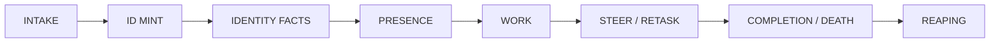
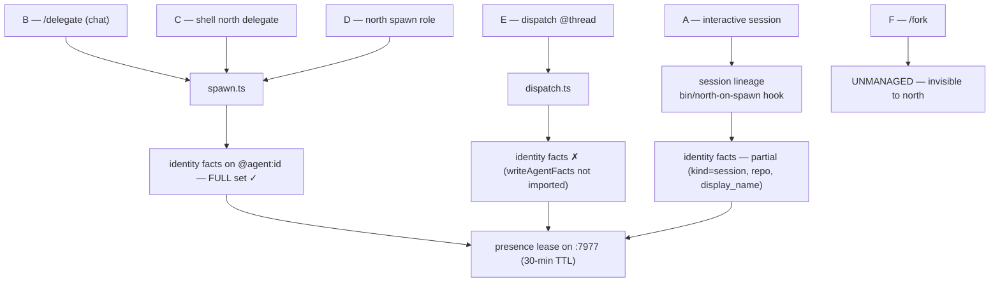
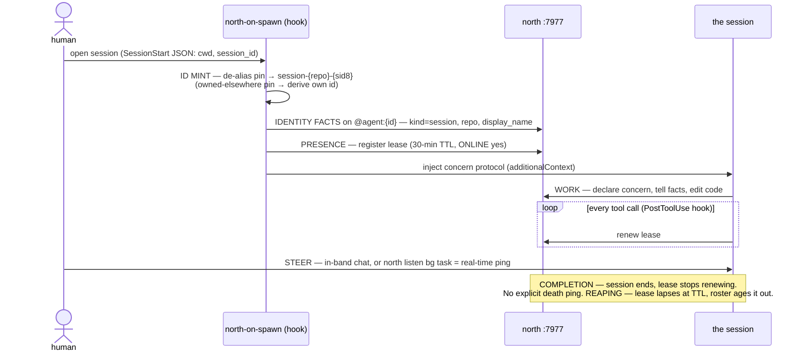
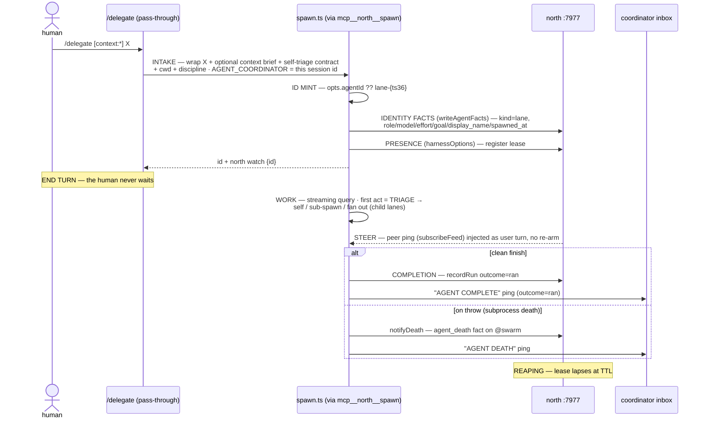
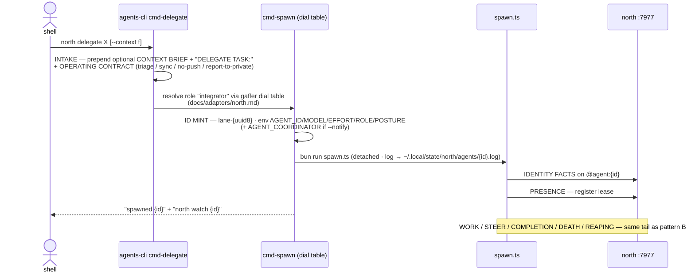
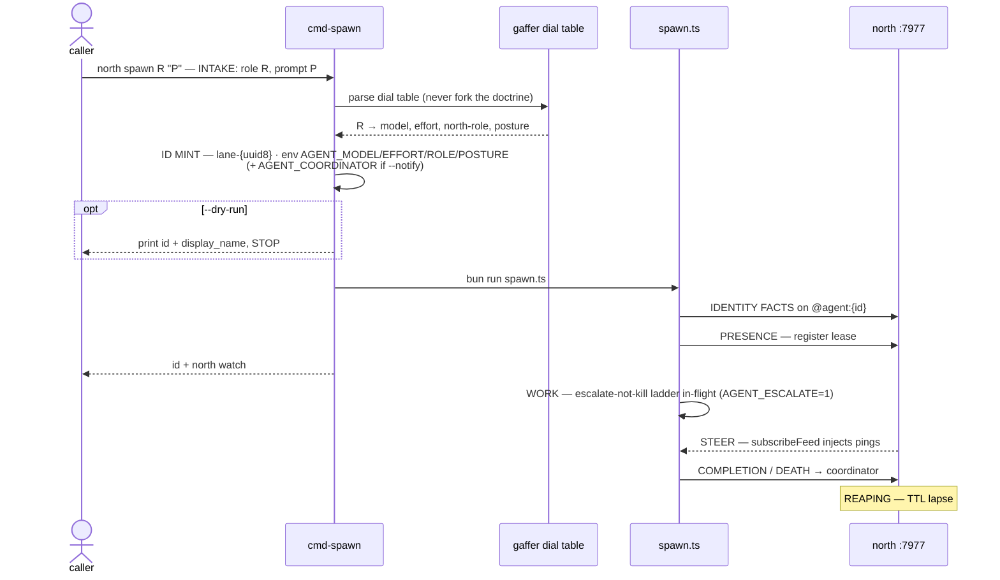
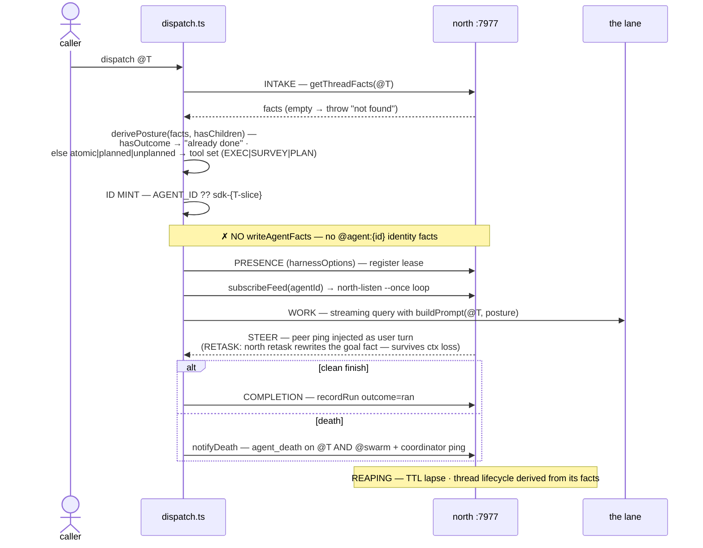
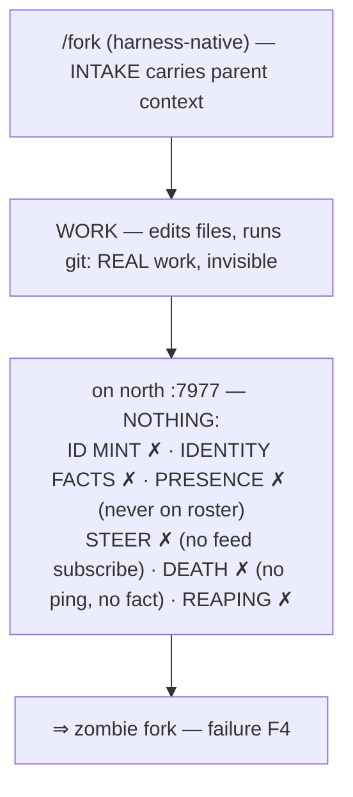
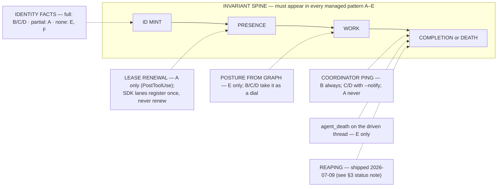
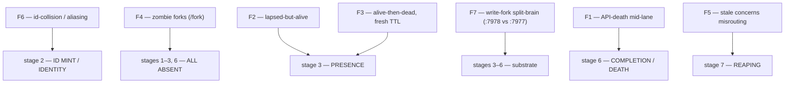

# The workflow map

*The definitive diagram-in-prose of the agentic stack's dispatch pipelines,
doubling as the pipeline-debug spec.*

> **Naming.** The stack as a whole has no settled name yet; a naming pass is
> pending. Today the parts carry their own names and this doc uses them as
> found in source: **fram** (fact engine), **north** (coordination substrate),
> **gaffer** (staffing doctrine). The cockpit/dashboard folded into north
> (2026-07-10): `north dashboard` / `north doctor` / bare `north` (the card). Any of
> these names may change. Where this doc says "the stack" it means the whole;
> where it names a part it means that part's code as it exists on 2026-07-09.

This document is **grounded in source read on 2026-07-09**, not in memory.
Every claim below is either (a) traceable to a file cited inline, or (b)
explicitly flagged as an assumption. The companion audit
(`~/code/after-text/docs/private/lane-v3-report.md`) lists what was read and
what could not be verified from source.

---

## 0. Vocabulary (defined at first use)

| term | one-line definition |
|------|---------------------|
| **fact** | a triple `(subject predicate object)`; the only unit of state in fram/north |
| **thread** | any `@id` that has a `title` fact — a unit of work or thought |
| **lane / agent / worker** | one spawned unit of execution (never "fleet") |
| **coordinator** | the agent that spawned a lane and receives its completion/death pings |
| **`@agent:<id>`** | the fact subject carrying a lane's *identity* (kind/role/model/effort/goal/display_name) |
| **`@swarm`** | the coordinator-visible roster node; where `budget_total` and `agent_death` facts land |
| **concern** | a declared work footprint (files + intent); a coordination signal, **not a lock** — declaring never blocks |
| **presence / lease** | a heartbeat registration on the `:7977` coordinator with a **30-min TTL**; renewed (in session agents) on tool use |
| **posture** | how a lane works (`deliver` / `explore`); derived from thread facts by `dispatch`, or passed on `spawn` |
| **role** | a `(model, effort)` pin plus a prompt block; gaffer names it, north delivers it |
| **the reactor** | a long-lived sidecar (`north reactor`) that re-projects touched threads off the commit firehose; the intended home of specced auto-reaping |

**The two ports** (simplified 2026-07-09 — `:7978`/`:7980` retired, modules deleted;
`:7978` was the stranded split-brain source of §3 F7, `:7980`'s dark-room log held
only a bootstrap tx):

| port | role |
|------|------|
| `:7977` | **north coordinator** — the canonical fact log. Roster, concerns, board, mail, presence ALL read AND write here. |
| `:8088` | north web — Phoenix cockpit (systemd-supervised: `north-web.service`) |

---

## 1. THE WORKFLOW PATTERNS

Six ways work becomes a running lane. Each is drawn as a sequence diagram over
the same lifecycle spine:



Two spawn *lineages* underlie all six. Knowing which lineage a pattern rides
tells you which facts to expect:

- **SDK-lane lineage** — `sdk/src/spawn.ts` (ad-hoc prompt) or
  `sdk/src/dispatch.ts` (thread-driven). Both call `harnessOptions()` which
  calls `registerPresence()` (`harness.ts:261`). **Only `spawn.ts` also calls
  `writeAgentFacts()`** (`spawn.ts:35`) — `dispatch.ts` does not import it, so
  a dispatched lane registers presence but writes **no** `@agent:<id>` identity
  facts. This asymmetry is load-bearing for §3.
- **Session lineage** — a Claude Code session. The `bin/north-on-spawn`
  SessionStart/SubagentSessionStart hook registers presence and writes three
  identity facts (`kind=session`, `repo`, `display_name`), then injects the
  concern protocol via `additionalContext`.

`mcp__north__spawn` and `mcp__north__dispatch` are the MCP tool faces of the SDK
lineage (registered in `harness.ts`'s `NATIVE_TOOLS`). The CLI faces are
`north spawn` / `north delegate` (in `cli/agents-cli.clj`), which resolve gaffer
dials and then `bun run sdk/src/spawn.ts`.



> **`command_peer` — the decentralized initiator.** Any of patterns B–E can be
> *started by a peer instead of a human*, with no human relay. `command_peer`
> (`harness.ts:55`, tool `mcp__north-peer__command_peer`) shells to
> `msg-cli send-cmd`, which asserts a command as facts on `@cmd:<id>` (op ∈
> {spawn, dispatch, tell, acquire}); the target's reactor triggers on the
> `target` routing key and runs the op. So "peer commands a spawn" is just
> pattern D/E with a fact-feed trigger in front of INTAKE.

---

### Pattern A — interactive session work

**Trigger:** a human opens a Claude Code session in a repo.
**Lineage:** session (`bin/north-on-spawn`).



Notes: a session mints its id **itself** in the hook, de-aliasing an inherited
`NORTH_AGENT_ID` pin (§3 id-collision). It has no `coordinator`, so there is **no
AGENT COMPLETE / AGENT DEATH ping** — its end is observed only as the lease
lapsing. Renewal is real here: the Claude-Code **PostToolUse hook** renews the
30-min lease on tool calls (`presence-cli.clj:21`), so `EXPIRES` tracks
activity.

---

### Pattern B — `/delegate` (chat)

**Trigger:** a human types `/delegate [context:all|none] <text>` (`commands/delegate.md`).
**Lineage:** SDK-lane via `spawn.ts`, always opus/high/integrator/deliver.
The CONTEXT DIAL is a parameter, not a separate verb: `context:all` composes and
attaches this session's brief; `context:none` starts fresh; absent → the session
picks. (Merges the retired `/request` + `/offload`.)



Notes: `/delegate` is a **strict pass-through** — the human's turn does no triage,
no work; one spawn, one confirmation, end of turn (context:all adds one step:
compose the brief). The *lane* self-triages (routes down / fans out) as its first
act. The coordinator hears back exactly
twice: `AGENT COMPLETE` on clean finish (`spawn.ts:147`) or `AGENT DEATH` on a
caught subprocess death (`death.ts`).

---

### Pattern C — shell `north delegate`

**Trigger:** `north delegate "<text>" [--context <file>]` at a shell (`agents-cli.clj:cmd-delegate`).
**Lineage:** identical to B (opus/high/integrator), minted from the CLI.
ASYMMETRY: `context:all` (a session composing its OWN brief live) is chat-only;
the shell attaches a pre-composed brief with `--context <file>` instead.



Notes: same contract, same dials, same completion/death/reaping as B. The
difference is **intake surface only** (shell vs `/delegate` slash command). The lane
runs detached with its transcript at `~/.local/state/north/agents/<id>.log`
(watched by `north watch <id>`).

---

### Pattern D — `north spawn <role>`

**Trigger:** `north spawn <role> "<prompt>"` (or `mcp__north__spawn`). The
general single-lane path; role picks the dials.
**Lineage:** SDK-lane via `spawn.ts`.



Notes: this is the surface gaffer's doctrine actually routes to under
`dispatch=north`. The **role→dials** resolution is by *parsing* gaffer's
canonical table (`agents-cli.clj:dial-table`), never re-deriving it. Optional
**escalate-not-kill**: with `AGENT_ESCALATE=1` a struggling lane climbs the
`LADDER` in-flight (`spawn.ts:88-106`) instead of dying at a turn cap.

---

### Pattern E — thread-driven dispatch

**Trigger:** `mcp__north__dispatch <thread>` (or `bun run dispatch.ts <id>`).
Work already lives as a thread; posture is *derived from its facts*.
**Lineage:** SDK-lane via `dispatch.ts` — **no identity facts written.**



Notes: dispatch is the only pattern that reads a **posture from the graph**
rather than taking it as a parameter. Its death path is richer — it writes an
`agent_death` fact on **both** the driven thread `@T` *and* `@swarm`
(`death.ts:deathCommands`), because the thread is the durable home of that
work. The **missing identity facts** mean a dispatched lane shows on the roster
by bare id only (no `display_name`) — a real legibility gap the
coordination-v2 identity work (§3) is meant to close.

---

### Pattern F — fork-with-context (`/fork`) — UNMANAGED

**Trigger:** `/fork` (context-carrying fork). **Not found in source** on
2026-07-09; treated as *unmanaged* per the task framing and the audit.
**Lineage:** none of the above.



Notes: this is the **hole in the map**. A `/fork` produces a real working actor
that touches the repo but appears in *none* of north's observable stages — no
id, no identity, no presence, no death signal. That is the direct cause of
"zombie forks" (§3). Bringing `/fork` onto the SDK-lane lineage (id mint +
identity + presence + death ping) is the obvious remedy but is **not
implemented today.**

> **Status note (2026-07-10, updated). Managed context-carrying handoff** is the
> `context:all` mode of the unified delegation verb: shell `north delegate
> "<task>" --context <file>` (`agents-cli.clj:cmd-delegate`) and slash `/delegate
> context:all` (`commands/delegate.md`) — a context-carrying handoff on the
> SDK-lane lineage (pattern C's contract + a prepended parent-context brief), so
> it gets the full invariant spine (id mint · identity facts · presence ·
> completion/death ping). (The delegation surface unified 2026-07-10: the earlier
> `north fork` / `/offload` verbs merged into `delegate`, context as a parameter.)
> The harness-native `/fork` itself remains unmanaged (F4 still applies to it);
> `/delegate` is the managed alternative to reach for, not a shadow of the builtin
> — the native `/fork` is a `local-jsx` builtin, and `/delegate`'s distinct name
> avoids the same-named-command collision.

---

## 2. CONSTANT vs CONDITIONAL — the invariant spine

The pipeline-debug question is: *for a given pattern, which lifecycle stages
must I be able to observe, and which are pattern-specific?*



The same content as a table with two labelled columns:

| **INVARIANT SPINE** (must appear in every *managed* pattern A–E) | **CONDITIONAL** (pattern-specific) |
|---|---|
| **ID MINT** — an id exists on `:7977` | **IDENTITY FACTS full set** — only `spawn.ts` (B/C/D) + partial for sessions (A). `dispatch.ts` (E) writes none; `/fork` (F) writes none |
| **PRESENCE** — a lease registered on `:7977` | **LEASE RENEWAL** — only session lineage (A) renews via PostToolUse; SDK lanes register once, never renew (grep `harness.ts`: `register` only, no `renew`) |
| **WORK** — a streaming query runs (or, for A, the session) | **POSTURE FROM GRAPH** — only E derives posture from thread facts; B/C/D take it as a dial |
| **COMPLETION or DEATH** — the run resolves (`recordRun` outcome, or session end) | **COORDINATOR PING** — only when `AGENT_COORDINATOR` is set (B always; C/D with `--notify`; E if env set). Sessions (A) never ping |
| — | **`agent_death` on the driven thread** — only E (dispatch knows `@T`); B/C/D write it on `@swarm` only |
| — | **ESCALATE-NOT-KILL** — only with `AGENT_ESCALATE=1` (spawn.ts) |
| — | **REAPING** — specced (coordination-v2), not yet shipped; see §3 |

> `/fork` (F) is deliberately **outside** the invariant spine: it satisfies
> *none* of it. That is precisely why it is a failure source, not a pattern you
> can debug with these commands.

### The invariant spine as a checklist

**A healthy managed lane (patterns A–E) shows these observable facts/events, in
order. Each line names the exact command to confirm it.** This IS the
pipeline-debug checklist and the spec skeleton for a future `north trace
<agent-id>`.

1. **ID exists on the roster.**
   `north agents` → the id appears in the live list.
   (Or `bb ~/code/north/cli/presence-cli.clj 7977 presence` for the raw table.)

2. **Identity facts written** *(full for B/C/D; `kind=session`+repo for A;
   ABSENT for E — that absence is expected, not a bug).*
   `north show @agent:<id>` → expect `kind`, `role`, `model`, `effort`, `goal`,
   `display_name`, `spawned_at`.

3. **Presence lease held, ONLINE.**
   `north agents` → `ONLINE yes`, `EXPIRES <n>s` (not `lapsed`).
   Dashboard view: `north dashboard` → the agents pane shows `● <display_name> ttl <n>s`.

4. **Work is advancing.**
   `north watch <id>` → transcript tail moves (or web `http://127.0.0.1:8088`).
   Footprint: `~/code/north/bin/concern ls <repo>` → the lane's concern is
   declared and `building`.

5. **Steer/retask lands** *(only if you sent one)*.
   Sent a ping: `bb ~/code/north/cli/msg-cli.clj 7977 inbox <id>` → the message
   is listed (and, once seen, `thread <msg-id>` shows `acked_by`).
   Retasked: `north show @agent:<id>` → `goal` and `display_name` reflect the new
   task (`north retask` rewrites the fact — survives context loss).

6. **Completion or death signal fired.**
   Clean finish: `bb ~/code/north/cli/msg-cli.clj 7977 inbox <coordinator>` →
   `AGENT COMPLETE outcome=ran`.
   Death: `north show @swarm` → an `agent_death` fact `"<id> | <reason> | <ts>"`;
   for dispatch (E) also `north show @<thread>`. Telemetry: the run's
   `outcome="died"`.

7. **Reaping.** *(Specced, not shipped — see §3.)*
   Today: `north agents` → the id ages to `lapsed` / drops off after the 30-min
   TTL; `concern ls` may still show a stale `building` concern.
   Intended (coordination-v2): a `STALE` render on owner-lapse and a reactor
   `abandoned` fact after 24h.

---

## 3. FAILURE MODES observed in the field

Each is mapped to the **checklist stage** (§2) where it manifests. Field
evidence is cited from the coordination-v2 design thread
(`019f4418-bed5-7625-b2ad-41abb6518269`, census dated 2026-07-09) and from
code comments recording specific incidents. Occurrence counts attributed to the
task brief are flagged as such.



> **Status note (2026-07-09, after this map was written).** Coordination-v2
> lane V1 landed the same day (north `17b3e97`): STALE/HANDOFF concern rendering
> on owner-lapse, reactor auto-abandon after 24h (`abandoned-stale`), the ≥60s
> activity-heartbeat throttle (session lineage), and stuck-fork reaping (lane
> lapsed >30min with no `outcome` → `died-unreported`). The "specced" remedies
> in F2/F3/F5 below are now LIVE — except SDK-lane lease renewal, which still
> registers once and never renews (F2 remains real for SDK lanes).

| # | failure mode | stage | what actually happens | field evidence |
|---|--------------|-------|------------------------|----------------|
| F1 | **API-death mid-lane** | 6 (COMPLETION/DEATH) manifesting during 4 (WORK) | The SDK runs the turn in a subprocess; OOM SIGKILL / parent SIGTERM / idle "Transport is closed" makes the async generator throw `exitError`. The error boundary (`spawn.ts:132`, `dispatch.ts:98`) catches it → `outcome="died"` + `notifyDeath`. Partial result still returned (supervision, not fail-fast). | thread progress: "alive-then-dead (N lanes died…)"; brief cites **7+ occurrences 2026-07-08/09** *(count per brief)* |
| F2 | **lapsed-but-alive** | 3 (PRESENCE) | Lease TTL (30 min) expires while the lane is still working. SDK lanes register once and **never renew** (no PostToolUse in a bun subprocess), so a long lane goes `lapsed` though alive. Roster reads it as gone. | thread progress: "lapsed-but-alive (R1b committed after lapse)" |
| F3 | **alive-then-dead with fresh TTL** | 3 (PRESENCE) — inverse of F2 | The lane dies but its 30-min lease has not expired, so `north agents` still shows `ONLINE yes / <n>s`. If death was a hard SIGKILL that skipped the `finally`, even the death ping may be missing. | thread progress: "alive-then-dead (N lanes died with fresh TTL)" |
| F4 | **zombie forks** | 1–3, 6 ALL ABSENT | A `/fork` (pattern F) does real work with no id mint, no identity, no presence, no death ping — invisible to every observation command. | §1 pattern F; brief |
| F5 | **stale concerns misrouting** | 7 (REAPING absent) | A concern owned by a dead/lapsed agent stays `building`; `concern overlap` still counts it, so a live lane shapes its work around a footprint that will never land — or is routed off it. | thread census: "17 STALE-building from dead agents… stale concern misrouted lane X-E" |
| F6 | **id-collision / aliasing** | 2 (ID MINT) | An inherited `NORTH_AGENT_ID` pin (a parent's env leaking into a subagent — SubagentSessionStart fires with the subagent's own `session_id` but the parent's env) makes two live actors share one `@agent:<id>`: mail answered by the wrong actor; roster phantom flood. Guarded now by the de-alias logic in `north-on-spawn` (only the *first* acquirer keeps a pin). | `north-on-spawn` comments: 2026-07-03 `cc-fram-*` had 3 workstreams + mail to wrong actor; 2026-07-02 **188 `cc-after-text-*` ghosts** |
| F7 | **write-fork (split-brain)** | 3–6 substrate | Writes land on the stranded `:7978` daemon instead of the canonical `:7977` log; roster/board/concern all read `:7977`, so the facts are "written" yet invisible. | `north-on-spawn:53`, `harness.ts:122-123` ("presence on :7978 stranded"); `concern-cli.clj:54` ("split-brain that stranded `reached landed` facts invisibly, 2026-07-02"); brief cites a **2026-07-08 cutover incident** *(date per brief; the split-brain mechanism is in source, the specific 07-08 event is not a thread I read)* |

---

## 4. THE DEBUG PLAYBOOK — spec for `north trace <agent-id>`

For each failure mode: how it **presents** on the dashboard, the **one command
that confirms it**, and the **remedy**. A future `north trace <agent-id>` should
walk the §2 checklist for one id and flag the first stage that fails; the rows
below are its rule set.

### F1 — API-death mid-lane
- **Presents:** lane vanishes from `north watch`; may still show `ONLINE` briefly
  (→ F3); coordinator gets an `AGENT DEATH` ping.
- **Confirm:** `north show @swarm` → `agent_death` fact for the id; for a
  dispatched lane also `north show @<thread>`. Cross-check `outcome="died"` in
  telemetry.
- **Remedy:** re-dispatch the thread (`mcp__north__dispatch @T` is idempotent —
  `hasOutcome` short-circuits if it actually finished). For chronic deaths,
  enable **escalate-not-kill** (`AGENT_ESCALATE=1`) so struggle climbs the
  ladder instead of dying. Partial result was returned — read it before retry.

### F2 — lapsed-but-alive
- **Presents:** `north agents` shows `EXPIRES lapsed` but `north watch` transcript
  is still moving / commits still landing.
- **Confirm:** `north watch <id>` advances **after** the lease shows `lapsed`;
  or a `committed`/`reached` fact timestamped later than the lease expiry.
- **Remedy (today):** treat `lapsed` as advisory, not death — confirm with the
  transcript before reaping. **Remedy (specced, coordination-v2 item 2):**
  PostToolUse-style heartbeat that renews on activity, so TTL means *is-working*
  and expiry becomes a real death signal.

### F3 — alive-then-dead with fresh TTL
- **Presents:** `north agents` shows `ONLINE yes / <n>s` but nothing is
  happening; `north watch` is frozen.
- **Confirm:** transcript tail is stalled **and** an `agent_death` fact exists
  (`north show @swarm`) OR the run's `outcome="died"`. A frozen tail with a live
  lease and *no* death fact = hard SIGKILL that skipped `finally` (worst case).
- **Remedy (today):** trust the `agent_death`/`outcome` over the lease. **Remedy
  (specced):** activity-derived heartbeat (as F2) makes a stalled lease decay
  quickly; the reactor's auto-abandon closes the gap.

### F4 — zombie forks
- **Presents:** repo is changing (new commits, edited files) but the actor is on
  **no** roster and answers **no** mail.
- **Confirm:** `git log --oneline -5` / working-tree diff shows edits with **no
  matching id** in `north agents` and **no** `@agent:<id>` from `north show`.
- **Remedy (today):** none automatic — identify the fork by its edits and
  coordinate out-of-band. **Structural remedy:** put `/fork` on the SDK-lane
  lineage (id mint + `writeAgentFacts` + `registerPresence` + `notifyDeath`) so
  it enters the invariant spine.

### F5 — stale concerns misrouting
- **Presents:** `north dashboard` concerns pane counts a repo's concerns high, but the
  owners are not in the live-agents pane.
- **Confirm:** `~/code/north/bin/concern ls <repo>` shows `building` concerns
  whose owner id is `lapsed`/absent in `north agents`.
- **Remedy (today):** manually `concern status <id> done`/abandon the orphan.
  **Remedy (specced, coordination-v2 item 1):** owner-presence-lapsed →
  concern renders `STALE` (pure projection, no write); `STALE >24h` → reactor
  writes an `abandoned` fact; `likely-to-land` survives lapse as a handoff.

### F6 — id-collision / aliasing
- **Presents:** one id on the roster with contradictory focus; a peer's reply
  arrives from the "wrong" actor; roster floods with near-duplicate ids.
- **Confirm:** `north show @agent:<id>` shows facts that cannot belong to one
  actor (two repos/goals racing); or `north agents` lists many
  `session-<repo>-*` phantoms.
- **Remedy:** already guarded — `north-on-spawn` honors a `NORTH_AGENT_ID` pin (legacy `TERN_AGENT_ID` accepted transitionally)
  **only** if no other session owns it (first-acquirer wins), else derives
  `session-<repo>-<sid8>`. If phantoms predate the guard, they age out at TTL.
  Never re-export a parent's `NORTH_AGENT_ID` into a child spawn.

### F7 — write-fork (split-brain)
- **Presents:** a lane reports "told" / "committed" but `north show` / `north
  board` never reflect it; facts seem to vanish.
- **Confirm:** the write targeted `:7978` (or any non-`:7977` port) while
  roster/board/concern read `:7977`. Check the port every tool used
  (`TERN_PORT`, daemon-health in `north doctor` → `7978 agent`).
- **Remedy:** force everything onto the canonical `:7977` log (the default in
  `harness.ts`, `north-on-spawn`, `presence-cli`). Never point a writer at
  `:7978`; it is stranded by design. `north doctor` surfaces daemon skew.

---

## Appendix — source index (what backs each claim)

| subsystem | file | what it establishes |
|-----------|------|---------------------|
| verb routing | `~/code/north/bin/north` | life/engine/agent verb split; `:7977` canonical; fail-closed `tell` resolve |
| SDK ad-hoc spawn | `~/code/north/sdk/src/spawn.ts` | id mint, `writeAgentFacts`, error boundary, escalate-not-kill, completion ping |
| thread dispatch | `~/code/north/sdk/src/dispatch.ts` | posture-from-facts, **no identity facts**, `subscribeFeed`, dual `agent_death` |
| real-time steer | `~/code/north/sdk/src/coordination.ts` | streaming-input channel, host-side `north-listen` re-arm |
| death signal | `~/code/north/sdk/src/death.ts` | `agent_death` fact (@swarm/thread) + coordinator ping; synchronous, swallowed |
| harness/presence | `~/code/north/sdk/src/harness.ts` | `registerPresence` (:7977), NATIVE_TOOLS, `command_peer` server |
| identity facts | `~/code/north/sdk/src/identity.ts` | `@agent:<id>` predicate set + `display_name` render |
| session hook | `~/code/north/bin/north-on-spawn` | session id de-alias, presence, `kind=session` facts, concern-protocol inject |
| agent CLI | `~/code/north/cli/agents-cli.clj` | `spawn`/`req`/`agents`/`watch`/`steer`/`retask`, dial-table parse |
| presence/lease | `~/code/north/cli/presence-cli.clj` | 30-min TTL, `presence` projection, `slackers`, `pin` |
| mail/commands | `~/code/north/cli/msg-cli.clj` | `send`/`inbox`/`ack`/`send-cmd` (@cmd facts), derived inbox |
| listener | `~/code/north/cli/north-listen.clj` | dormant-until-pinged pub/sub; role-addressing |
| cockpit | `~/code/north/cli/dashboard-cli.clj` (`north dashboard`/`doctor`; bare `north` card in `bin/north`) | dashboard/doctor/profile; parse-don't-fork gaffer; ownership rule (folded from convoy 2026-07-10) |
| staffing | `~/code/gaffer/doctrine.md` + `docs/adapters/north.md` | shapes→squad, laws, canonical dial table |
| delegate intake | `~/code/nixos-config/dotfiles/claude/commands/delegate.md` | `/delegate` pass-through contract (context as a parameter) |
| coordination-v2 | thread `019f4418-bed5-7625-b2ad-41abb6518269` | census, failure receipts, the specced reaping fix plan |
```
